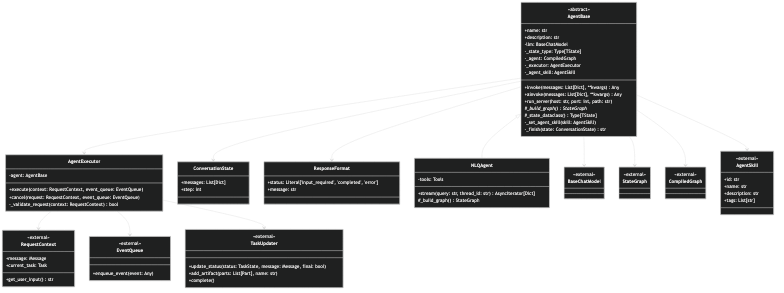

# Agent Module Documentation

The agent module provides the core functionality for creating and managing agents in the C3PO framework. This documentation covers the main components and their usage.

## Class Diagram

The following diagram shows the structure and relationships of the Agent module components:



The diagram illustrates:
- The abstract `AgentBase` class and its relationships
- Agent state management through `ConversationState`
- Response formatting with `ResponseFormat`
- Agent capabilities definition using `AgentSkill`
- Example implementation with `NLQAgent`

## Components Overview

### 1. AgentBase
The abstract base class for all agents in the system. It provides core functionality that all agents must implement.

**Key Features:**
- Abstract base class with generic type support
- Handles agent initialization and LLM setup
- Provides streaming and execution capabilities
- Manages agent skills and A2A server integration

**Abstract Methods:**
- `name`: Returns the agent's name
- `description`: Returns the agent's description
- `_build_graph()`: Builds the agent's execution graph

### 2. AgentExecutor
Handles the execution flow of agents and manages their lifecycle within the A2A framework.

**Key Features:**
- Manages agent execution context
- Handles streaming responses
- Processes task updates and status changes
- Error handling and validation

### 3. ConversationState
Manages the state of conversations between agents and users.

**Attributes:**
- `messages`: List of conversation messages
- `step`: Current conversation step counter

### 4. ResponseFormat
Defines the standard response format for agent communications.

**Attributes:**
- `status`: Response status ('input_required', 'completed', 'error')
- `message`: Response message content

## Implementation Example: NLQAgent

Here's a detailed example of implementing a custom agent using the NLQAgent implementation:

### 1. Basic Setup and Abstract Method Implementation

```python
from core.agent.Agent import AgentBase
from core.agent.ConversationState import ConversationState
from core.agent.ResponseFormat import ResponseFormat, FORMAT_INSTRUCTION
from core.model_provider.factory import ModelFactory
from core.util.ConfigLoader import load_env_variables, get_secret
from a2a.types import AgentSkill

class NLQAgent(AgentBase[ConversationState]):
    # Implementing required abstract properties
    @property
    def name(self) -> str:
        return "NLQ Agent"

    @property
    def description(self) -> str:
        return "Helps with converting NL to SQL and executing the SQL queries"

    def __init__(self):
        # Load environment variables and configuration
        env = load_env_variables()
        provider = env['PROVIDER']
        model = env['MODEL']
        model_base_url = env['MODEL_BASE_URL']
        secret_name = env['SECRET_NAME']
        model_api_key = get_secret(secret_name)['DATABRICKS_TOKEN']
        
        # Create LLM provider
        llm_provider = ModelFactory.create_provider(
            provider=provider, 
            model_name=model,
            base_url=model_base_url,
            api_key=model_api_key
        )
        llm = llm_provider.get_llm()
        
        # Set up tools
        self.tools = Tools.generate_sql_code
        
        # Initialize base agent
        super().__init__(llm=llm)
        
        # Define agent skill
        skill = AgentSkill(
            id='convert_to_sql',
            name='Convert NL to SQL tool',
            description='Helps with converting NL to SQL',
            tags=['NLQ']
        )
        self._set_agent_skill(skill)
```

### 2. Building the Agent Graph

```python
def _build_graph(self):
    from langgraph.prebuilt import create_react_agent
    from langgraph.checkpoint.memory import MemorySaver
    from core.prompt.StaticPromptMap import prompt_map
    
    memory = MemorySaver()
    
    main_agent = create_react_agent(
        model=self.llm,
        tools=[self.tools],
        checkpointer=memory,
        prompt=prompt_map["generate_sql"],
        response_format=(FORMAT_INSTRUCTION, ResponseFormat)
    )
    return main_agent
```

### 3. Implementing Streaming

```python
async def stream(self, query: str, thread_id: str) -> AsyncIterator[dict[str, Any]]:
    print("Streaming structured agent...")
    inputs = {'messages': [('user', query)]}
    config = {'configurable': {'thread_id': thread_id}}
    
    async for output in self._agent.astream(inputs, config):
        message = output[next(iter(output))]['messages'][-1]
        if isinstance(message, ToolMessage) and message.status != "error":
            yield {
                'is_task_complete': True,
                'require_user_input': False,
                'content': str(message),
            }
            break
        else:
            pass
```

### 4. Running the Agent Server

```python
if __name__ == "__main__":
    agent = NLQAgent()
    agent.run_server(host="0.0.0.0", port=8000, path="/agents/nlq")
```

## Usage Patterns

### Creating a Simple Agent

```python
from core.agent.Agent import AgentBase
from core.agent.ConversationState import ConversationState
from core.model_provider.factory import ModelFactory

class SimpleAgent(AgentBase[ConversationState]):
    @property
    def name(self) -> str:
        return "Simple Agent"
    
    @property
    def description(self) -> str:
        return "A simple example agent"
    
    def __init__(self):
        # Initialize LLM
        llm_provider = ModelFactory.create_provider(
            provider="bedrock",
            model_name="anthropic.claude-3-sonnet-20240229"
        )
        llm = llm_provider.get_llm()
        super().__init__(llm=llm)
    
    def _build_graph(self):
        # Simple implementation
        return self.llm  # Return LLM directly for simple cases
```

### Using Agent Methods

```python
# Synchronous invocation
result = agent.invoke([{"role": "user", "content": "Hello"}])

# Asynchronous invocation
result = await agent.ainvoke([{"role": "user", "content": "Hello"}])

# Streaming
async for chunk in agent.stream("Hello", "thread-123"):
    print(chunk)
```

## API Reference

### AgentBase Class

#### Constructor
```python
def __init__(self, llm: BaseChatModel) -> None
```
- `llm`: The language model to use for the agent

#### Methods

**invoke(messages, **kwargs)**
- Synchronous single-shot call bypassing A2A
- Returns: Agent response

**ainvoke(messages, **kwargs)**
- Asynchronous single-shot call bypassing A2A
- Returns: Agent response (awaitable)

**run_server(host, port, path)**
- Starts the A2A agent server
- `host`: Server host (default: "0.0.0.0")
- `port`: Server port (default: 8000)
- `path`: Server path (default: "/agents/")

### AgentExecutor Class

#### Methods

**execute(context, event_queue)**
- Executes the agent with given context
- Handles streaming and task updates
- Manages error handling

**cancel(request, event_queue)**
- Cancels agent execution
- Returns: Task or None

### ConversationState Class

#### Attributes
- `messages`: List[Dict] - Conversation messages
- `step`: int - Current conversation step (default: 0)

### ResponseFormat Class

#### Attributes
- `status`: Literal['input_required', 'completed', 'error'] - Response status
- `message`: str - Response message

## Best Practices

1. **Always implement abstract methods**: Ensure `name`, `description`, and `_build_graph()` are properly implemented
2. **Handle errors gracefully**: Implement proper error handling in your agent logic
3. **Use appropriate state management**: Extend ConversationState if you need custom state
4. **Set agent skills**: Always define agent skills for A2A integration
5. **Implement streaming**: For better user experience, implement async streaming
6. **Use proper logging**: Add logging for debugging and monitoring
7. **Resource management**: Properly handle LLM and memory resources

## Error Handling

### Common Patterns

```python
try:
    result = agent.invoke(messages)
except Exception as e:
    # Handle agent execution errors
    logger.error(f"Agent execution failed: {e}")
    return {"status": "error", "message": str(e)}
```

### Validation

```python
def _validate_request(self, context: RequestContext) -> bool:
    user_text = context.get_user_input()
    if not user_text or len(user_text) > 4096:
        logger.warning("Empty or too-long input")
        return True
    return False
```

## Testing

### Unit Testing Example

```python
import pytest
from your_agent import YourAgent

@pytest.fixture
def agent():
    return YourAgent()

def test_agent_name(agent):
    assert agent.name == "Expected Name"

def test_agent_invoke(agent):
    result = agent.invoke([{"role": "user", "content": "test"}])
    assert result is not None
```

## Integration with Other Modules

The agent module integrates with:
- **Model Provider**: For LLM initialization
- **Prompt**: For prompt management
- **Utility**: For configuration and helpers
- **Memory**: For conversation state management

See the respective module documentation for detailed integration examples.